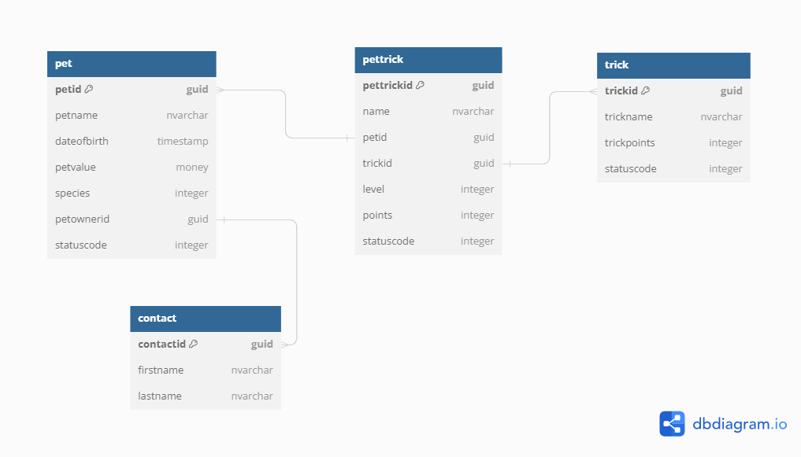

---
demo:
    title: 'Demo 3: Tables'
    module: '1: Work with Microsoft Dataverse'
---

# Demo 3 - Tables

**Objective:** In this demo, you will show how to create tables in a Dataverse solution. In later demos you will add columns and relationships.

## Task 3.1 - Create table for Pets

1. Navigate to the Power Apps maker portal <https://make.powerapps.com>.

1. Select the **Demo** environment.
1. Select **Solutions** from the left navigation pane.
1. Select the **PL400 Demos** solution.
1. Select **+ New** and then select **Table** and select **Table** again.
1. Enter `Pet` for **Display Name**.
1. Check **Enable attachments**.
1. Expand **Advanced options**.
1. Change Schema name to lower case.
1. Show options for Type and select **Standard**.
1. Show options for Record ownership and select **User or team**.
1. Scroll down and show the other table options.
1. Check **Audit changes to its data**.
1. Check **Create a new activity**.
1. Check **Appear in search results**.
1. Uncheck **Doing a mail merge**.
1. Select the **Primary column** tab.
1. Change the **Display Name** to `Pet Name`.
1. Expand **Advanced options**.
1. Show the options for the primary column.
1. Change Schema name to lower case.
1. Enter `30` for Maximum character count.
1. Select **Save**.
1. Select **All** in the Objects tree.

## Task 3.2 - Create table for Tricks

1. Select **+ New** and then select **Table** and select **Table** again.

1. Enter `Trick` for **Display Name**.
1. Expand **Advanced options**.
1. Change schema name to lower case.
1. Select **Organization** for Record ownership.
1. Check **Audit changes to its data**.
1. Check **Appear in search results**.
1. Uncheck **Doing a mail merge**.
1. Select the **Primary column** tab.
1. Change the **Display Name** to `Trick Name`.
1. Expand **Advanced options**.
1. Change Schema name to lower case.
1. Enter `50` for Maximum character count.
1. Select **Save**.
1. Select **All** in the Objects tree.

## Task 3.3 - Create table for Pet Tricks

1. Select **+ New** and then select **Table** and select **Table** again.

1. Enter `Pet Trick` for **Display Name**.
1. Expand **Advanced options**.
1. Change Schema name to lower case.
1. Uncheck **Apply duplicate detection rules**.
1. Uncheck **Doing a mail merge**.
1. Select the **Primary column** tab.
1. Expand **Advanced options**.
1. Change Schema name to lower case.
1. Select **Optional** for Column requirement.
1. Select **Save**.
1. Select **All** in the Objects tree.
1. Select **Publish all customizations**.
